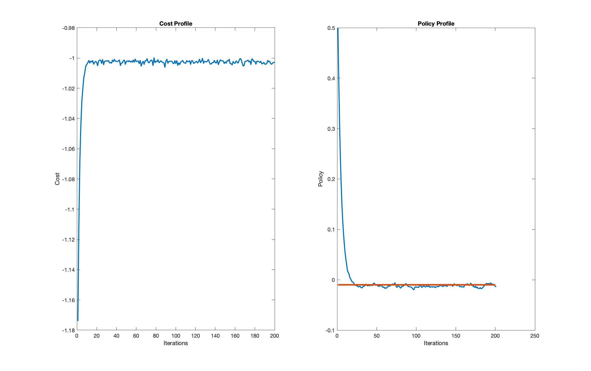

# Policy Gradient

This project document details the implementations of Finite Difference (FD) and the Reinforce Policy Gradient (RPG) methods. A brief overview of the implementation is provided, and the methods are implemented for a scalar system with simple dynamics and reward functions. 

#### Keywords
Finite-Differencing Reinforcement Learning, Episodic Reinforce

## Finite Difference
The following pseudo-code describes the implementation of the Finite Difference Method. 

| Steps | Description | 
|1| Sample perturbations of the optimal policy, $\delta\theta$  | 
|2| Generate roll-outs of the trajectory for each perturbation | 
|3| Calculate cost, J, for each roll-out |
|4| Find change in cost, $\Delta J$ due to perturbation |
|5| Compute gradient of policy, update optimal policy with gradient|
|6| Repeat until the gradient converges

The cost function is defined as

$$
    \underset{\theta}{max}J=\underset{\theta}{max}\mathbb{E}\left[\sum\limits_{k=0}^{N}r(x_k,u_k)\right]
$$

Subject to the scalar stochastic dynamics of

$$
    x_{k+1}=Ax_k+Bu_k(x_k, \theta)+\epsilon_k
$$

The change in cost is found with

$$
    \Delta J_i=J(\theta+\delta\theta_i)-J(\theta)
$$

The gradient of the policy is found with

$$
     \nabla_\theta J=(\Delta\Theta^T\Delta\Theta)^{-1}\Delta\Theta^T\Delta J 
$$

$$
     \Delta\Theta = \left[ \delta\theta_i, ... ,  \delta\theta_M \right]^T \\ 
$$

$$
     \Delta J = \left[ \Delta J_i, ... , \Delta J_M \right ]^T 
$$

The reward is defined as

$$
    r(x_k,u_k)=x^TQx+u^TRu
$$

The linear feedback policy parameterization is defined as

$$
    u(x,\theta)=Kx_k
$$

### Results 

The Finite Differencing method converges close to the optimal gain, determined from LQR, but tends to oscillate around the optimal value. These fluctuations are directly related to the system noise represented by $\epsilon_k$ in the stochastic dynamic equation. 

**Plots of gain (right), and system reward (left) for the Finite Difference case. Here A = B = 0.1, and Q = R = -1.**

## Reinforce Policy Gradient
The following pseudo-code describes the implementation of RPG. 

\begin{table}[h]
    \centering
    \begin{tabular}{c|c}
        \textbf{Steps} & \textbf{Description} \\ [1ex]
        1 &  Initialize policy \\ 
        2 &  Create trajectory profiles by varying the exploration noise \\
        3 &  Calculate the gradient of the cost \\
        4 &  Update the policy using the gradient \\
        5 &  Repeat until policy has converged\\
